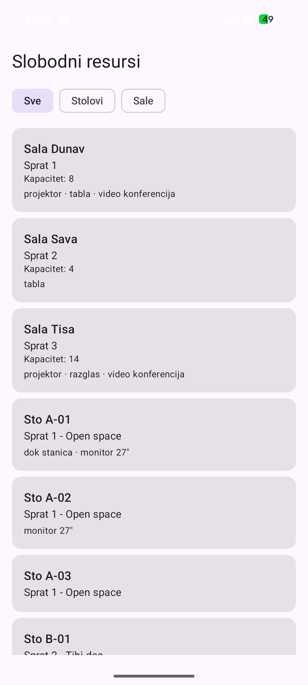

# Hot-Desking & Resource Booking System

Klijent-server sistem za rezervaciju deljenih resursa, radnih stolova i sala za sastanke,
u kompanijskom okruženju. Zaposleni pretražuju slobodne termine i rezervišu ih, a
administrator upravlja time koji su resursi uopšte na raspolaganju. Realizovan je u Kotlin
Multiplatform arhitekturi, sa deljenim modelom podataka i pravilima između Ktor servera
i Android klijenta.

---

## 1. Uloge i funkcionalnosti

Sistem razlikuje dve uloge sa različitim pogledom na iste podatke.

### Administrator

- **CRUD nad resursima:**  dodavanje stolova i sala, izmena opisnih parametara
  (kapacitet, lokacija, oprema)
- **Upravljanje raspoloživošću:** deaktivacija resursa koji je van funkcije ili se renovira
- **Globalni pregled:** uvid u sve rezervacije u sistemu, sa filtriranjem po korisniku
  ili po resursu

### Korisnik

- **Pretraga resursa:** filtriranje po tipu, lokaciji i opremi
- **Pregled dostupnosti:** dnevna mreža slobodnih i zauzetih termina za izabrani resurs
- **Rezervacija:** zauzimanje slobodnog termina
- **Moje rezervacije:** pregled aktivnih i isteklih, sa mogućnošću otkazivanja

### Dve odluke

**Deaktivacija resursa ne dira postojeće rezervacije.** Kaskadno otkazivanje bi korisniku
oduzelo termin bez ikakvog obaveštenja. Umesto toga
resurs izlazi iz ponude za nove rezervacije, a administrator u globalnom pregledu vidi koje
rezervacije još uvek vise nad njim i može da ih otkaže pojedinačno.

**Otkazivanje oslobađa termin, ali čuva zapis.** Rezervacija ostaje sa statusom `CANCELLED`.
Razlog je tehnički i objašnjen je u poglavlju 3.

---

## 2. Aplikacija u radu



Ekran je snimljen sa fizičkog uređaja (Pixel 8, Android 17) povezanog na server preko
lokalne mreže. Prikazano je svih sedam aktivnih resursa iz početnih podataka.

Odgovor servera na `GET /api/resources`, skraćen na tri resursa:

```json
[
  {
    "id": "e32cc098-37e6-4c92-98e5-4b8924bdfdb7",
    "name": "Sala Dunav",
    "type": "MEETING_ROOM",
    "location": "Sprat 1",
    "capacity": 8,
    "amenities": ["projektor", "tabla", "video konferencija"],
    "isActive": true
  },
  {
    "id": "1ab08deb-3935-4892-be16-ad3b9164b0c9",
    "name": "Sto A-01",
    "type": "DESK",
    "location": "Sprat 1 - Open space",
    "capacity": 1,
    "amenities": ["dok stanica", "monitor 27\""],
    "isActive": true
  },
  {
    "id": "dd60e947-5e8a-477d-b026-c67341bc92b8",
    "name": "Sto A-03",
    "type": "DESK",
    "location": "Sprat 1 - Open space",
    "capacity": 1,
    "amenities": [],
    "isActive": true
  }
]
```

Pun odgovor sadrži sedam resursa. `Seed.kt` upisuje osam, ali je `Sto B-02` neaktivan pa ga
podrazumevani filter `activeOnly=true` izostavlja — `GET /api/resources?activeOnly=false`
vraća i njega.

---

## 3. Ključni problem: sprečavanje preklapanja rezervacija

Rezervacija resursa nije CRUD zadatak. Čim dva korisnika istovremeno
zatraže isti termin, javlja se problem koji se ne rešava aplikativnom logikom.

### Problem

Naivna implementacija radi provera-pa-upis:

```kotlin
if (nemaPreklapanja(resourceId, start, end)) {   // ①
    upisiRezervaciju(...)                        // ②
}
```

Između ① i ② drugi zahtev može da upiše iste termine. Obe provere prolaze, obe rezervacije
se upisuju, dva čoveka dolaze u istu salu. Ovo je TOCTOU (*time-of-check to time-of-use*)
i ne rešava se dodavanjem provera.

### Razmatrani pristupi

| Pristup | Zašto nije izabran |
|---|---|
| `SELECT ... FOR UPDATE` nad resursom | Radi, ali serijalizuje sve rezervacije nad istim resursom i uvodi rizik od zastoja pri složenijim upitima |
| `SERIALIZABLE` izolacija + ponovni pokušaj | Radi, ali zahteva petlju ponovnog pokušaja u aplikaciji i teško se testira |
| PostgreSQL `EXCLUDE USING gist` nad `tstzrange` | Najelegantnije za slobodne vremenske opsege, ali H2 ga nema i projekat bi bio vezan isključivo za PostgreSQL |

### Izabrano rešenje

Vreme je diskretizovano na **slotove od 30 minuta** (radno vreme 08:00–20:00, 24 slota dnevno).
Rezervacija se čuva u dve tabele: zaglavlje u `bookings`, a jedan red po zauzetom slotu u
`booking_slots`, nad kojom stoji **jedinstveni indeks** `UNIQUE (resource_id, slot_start)`.

Rezervacija od 90 minuta upisuje tri reda. Preklapanje time postaje **fizički nemoguće**,
nezavisno od broja paralelnih zahteva; baza je jedini arbitar. Aplikacija ne proverava
zauzetost uopšte: piše odmah i hvata izuzetak narušavanja ograničenja, koji vraća kao
`409 Conflict`.

Prednosti:

- nema zaključavanja i nema petlje ponovnog pokušaja
- radi identično na H2 i na PostgreSQL-u
- delimično preklapanje (09:00–10:00 naspram 09:30–10:30) pada isto kao potpuno
- otkazivanje briše redove iz `booking_slots` i oslobađa termin, dok zaglavlje ostaje
  kao istorija — bez potrebe za parcijalnim indeksima, koje H2 ne podržava

### Merljiv rezultat

`server/src/test/kotlin/.../ConcurrencyTest.kt` ispaljuje 50 paralelnih zahteva za isti
termin i tvrdi da prolazi tačno jedan. Test se pokreće u dva prolaza:

1. bez jedinstvenog indeksa, sa provera-pa-upis logikom → pada, prolazi više rezervacija
2. sa jedinstvenim indeksom → prolazi

Izmereno, drugi prolaz, H2 baza u memoriji:

```
Paralelnih zahteva: 50 | prihvaceno: 1 | odbijeno (409): 49
```

Uz taj test prolaze i `delimicno_preklapanje_takodje_pada` (09:00–10:00 naspram 09:30–10:30,
dele tačno jedan slot) i `otkazana_rezervacija_oslobadja_termin`. Ukupno tri testa u `:server`
i deset testova `BookingRules` u `:core` — svi prolaze.

---

## 4. Arhitektura

Tri modula nose sistem:

```
          ┌─────────────────────────┐
          │         :core           │   Kotlin Multiplatform
          │  DTO klase + enumi      │   ne zavisi ni od čega
          │  BookingRules           │   čist Kotlin kod
          └───────────┬─────────────┘
                      │
          ┌───────────┴────────────┐
          │                        │
  ┌───────▼────────┐     ┌─────────▼─────────┐
  │    :server     │     │ :app:androidApp   │
  │  Ktor Server   │     │  Jetpack Compose  │
  │  Exposed ORM   │◄────┤  Ktor Client      │
  │  H2 / Postgres │ HTTP│  ViewModel + UDF  │
  └────────────────┘ JSON└───────────────────┘
```

`settings.gradle.kts` navodi i četvrti modul, `:app:shared`. Njega generiše zvanični
Kotlin Multiplatform čarobnjak kao mesto za deljeni Compose UI; u fazi 1 se ne koristi,
jer svi ekrani žive u `:app:androidApp`. Zadržan je za fazu 2, kada deljenje UI-ja
između platformi postane relevantno.

### Šta deljeni modul zapravo nosi

Modul ne sadrži samo prazne `data` klase. Nosi dve stvari koje se inače dupliraju i
vremenom raziđu:

**Enumi** (`Role`, `ResourceType`, `BookingStatus`). Da su `String`-ovi, server bi mogao da
pošalje `"meeting_room"` a klijent da očekuje `"MEETING_ROOM"`, i to bi se otkrilo tek u
vreme izvršavanja. Ovako kompajler odbija da izgradi projekat.

**`BookingRules`** validacija termina. Ista funkcija se izvršava na dva mesta sa dve svrhe:
na klijentu da korisnik odmah vidi zašto dugme ne radi, na serveru kao autoritet, jer se
klijentu ne veruje. Bez deljenog modula ta logika postoji dvaput i razilazi se pri prvoj
izmeni.

Testovi u `commonTest` izvršavaju se na svakom targetu, jedna provera dokazana istovremeno za server i za Android.

---

## 5. Model podataka

Sto i sala koriste **isti** model. Razlikuje se samo ono što interfejs nudi (sto se uzima za ceo dan ili pola dana, sala u blokovima od pola sata). Krajnje vreme je ekskluzivno:
rezervacija 09:00–10:00 zauzima slotove 09:00 i 09:30.

```
users                     resources                  resource_amenities
──────────                ──────────                 ──────────────────
id (PK)                   id (PK)                    resource_id (FK)
name                      name                       amenity
email (UQ)                type                       PK(resource_id, amenity)
password_hash             location
role                      capacity
                          is_active

bookings                          booking_slots
────────                          ─────────────
id (PK)                           booking_id (FK)
resource_id (FK) ─────────────┐   resource_id
user_id (FK)                  └──▶ slot_start
start_time                        ★ UNIQUE (resource_id, slot_start)
end_time
status
created_at
```

`bookings` nosi identitet, vlasnika i istoriju. `booking_slots` nosi garanciju zauzetosti.

---

## 6. Tehnološki stek

| Sloj | Tehnologija |
|---|---|
| Jezik | Kotlin, na svim slojevima |
| Deljeni modul | Kotlin Multiplatform |
| Backend | Ktor Server (Netty, korutine) |
| ORM | Exposed |
| Baza | H2 podrazumevano, PostgreSQL kroz konfiguraciju |
| Serijalizacija | kotlinx.serialization (JSON) |
| Android UI | Jetpack Compose, Material 3 |
| Upravljanje stanjem | ViewModel + StateFlow, unidirekcioni tok podataka |
| Mrežni klijent | Ktor Client (OkHttp engine) |

Baza se menja izmenom četiri linije u `server/src/main/resources/application.conf`; nijedna
linija aplikativnog koda ne zna koja je ispod. H2 je podrazumevan jer ne zahteva instalaciju.

Verzije su zaključane u `gradle/libs.versions.toml`:

| Komponenta | Verzija |
|---|---|
| Kotlin | 2.4.10 |
| Gradle | 9.1.0 |
| Android Gradle Plugin | 9.0.1 |
| Ktor (server i klijent) | 3.5.2 |
| Exposed | 1.0.0 |
| H2 | 2.3.232 |
| kotlinx.serialization | 1.11.0 |
| Compose Multiplatform | 1.11.1 |
| JDK | 21 (Temurin) |

Exposed 1.0 koristi pakete `org.jetbrains.exposed.v1.core` i `org.jetbrains.exposed.v1.jdbc`;
izraz-graditelji (`eq`, `less`, `greaterEq`, `inList`) su top-level funkcije koje se uvoze
sa `import org.jetbrains.exposed.v1.core.*`.

---

## 7. REST API

| Metod | Putanja | Uloga | Opis |
|---|---|---|---|
| `GET` | `/health` | — | Provera dostupnosti servera |
| `GET` | `/api/resources` | svi | Lista resursa; filteri `type`, `location`, `activeOnly` |
| `GET` | `/api/resources/{id}` | svi | Jedan resurs |
| `GET` | `/api/resources/{id}/availability?at=` | svi | Dnevna mreža slotova |
| `POST` | `/api/resources` | admin | Novi resurs |
| `PUT` | `/api/resources/{id}` | admin | Izmena resursa |
| `POST` | `/api/resources/{id}/deactivate` | admin | Deaktivacija |
| `POST` | `/api/resources/{id}/activate` | admin | Aktivacija |
| `POST` | `/api/bookings` | korisnik | Nova rezervacija → `201` ili `409` |
| `GET` | `/api/bookings/mine` | korisnik | Moje rezervacije |
| `GET` | `/api/bookings` | admin | Globalni pregled; filteri `userId`, `resourceId` |
| `DELETE` | `/api/bookings/{id}` | korisnik | Otkazivanje |

---

## 8. Faze izrade

| Faza | Sadržaj | Status |
|---|---|---|
| 1 | Vertikalni presek: deljeni DTO → Ktor ruta → baza → Compose lista | **urađeno** |
| 2 | Autentikacija (JWT + BCrypt), kreiranje rezervacija, mreža slotova u interfejsu | sledeće |
| 3 | Administratorski ekrani, filteri, globalni pregled | |
| 4 | Testovi konkurentnosti, merenja, PostgreSQL varijanta | |

---

## 9. Poznata ograničenja

Navedena svesno, kao predložene granice obima:

- **Vremenska zona** se računa kao fiksni pomeraj od UTC; prelaz na letnje/zimsko računanje
  vremena nije pokriven. Faza 2 predviđa prelazak na `kotlinx-datetime`.
- **Autentikacija u fazi 1** svodi se na zaglavlje `X-User-Id` i nije autentikacija. Menja se
  JWT-om u fazi 2.
- **Lozinke** su u početnim podacima u čistom tekstu i koriste se isključivo lokalno.
- **Ktor Client** je u `:app:androidApp`, ne u `:core`. Deljeni modul zato pokriva model i
  pravila, ali još ne i mrežni sloj. Razlog je što `ApiClient` koristi OkHttp engine, koji
  je platformski; selidba u `:core` traži `expect`/`actual` engine i predviđena je za fazu 2.

---

## 10. Pokretanje

Potreban je JDK 21; Gradle se preuzima kroz wrapper. Sve komande se pokreću **iz korena
projekta** — foldera u kome se nalazi `gradlew.bat`.

```bash
# Server — H2 baza, bez ikakve instalacije
.\gradlew.bat :server:run
# http://localhost:8080/api/resources
```

```bash
# Testovi
.\gradlew.bat :core:jvmTest     # pravila validacije (BookingRules)
.\gradlew.bat :server:test      # konkurentnost
```

Na Linux-u i macOS-u umesto `.\gradlew.bat` ide `./gradlew`.

Android modul se pokreće iz Android Studio-a, ili sa priključenim uređajem komandom
`.\gradlew.bat :app:androidApp:installDebug`.

Adresa servera se podešava na **dva** mesta i oba moraju da se slažu:

| Uređaj | `ApiClient.baseUrl` | `network_security_config.xml` |
|---|---|---|
| Emulator | `http://10.0.2.2:8080` | već sadrži `10.0.2.2` |
| Fizički telefon | `http://<IP-laptopa>:8080` | dodati `<IP-laptopa>` |

IP razvojne mašine se dobija komandom `ipconfig` (IPv4 Address). Oba uređaja moraju biti
na istoj mreži. Fajl `app/androidApp/src/main/res/xml/network_security_config.xml` postoji
zato što Android od verzije 9 blokira nekriptovani HTTP — bez upisane adrese aplikacija
tiho ne uspeva da se poveže, a poruka o grešci ne kaže zašto.
