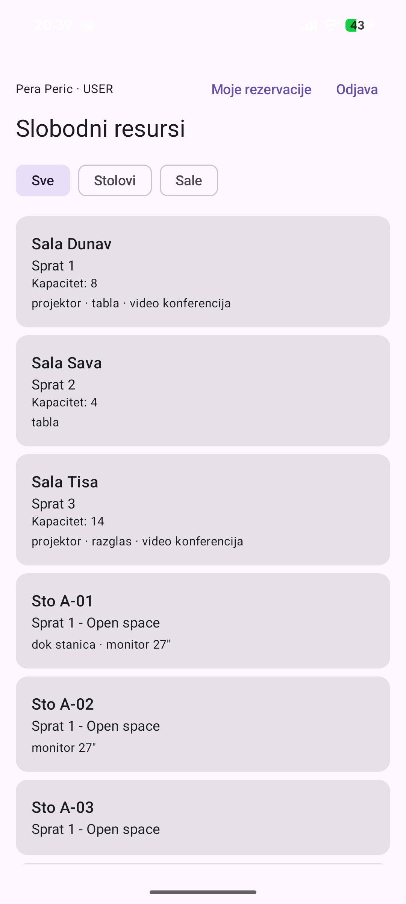
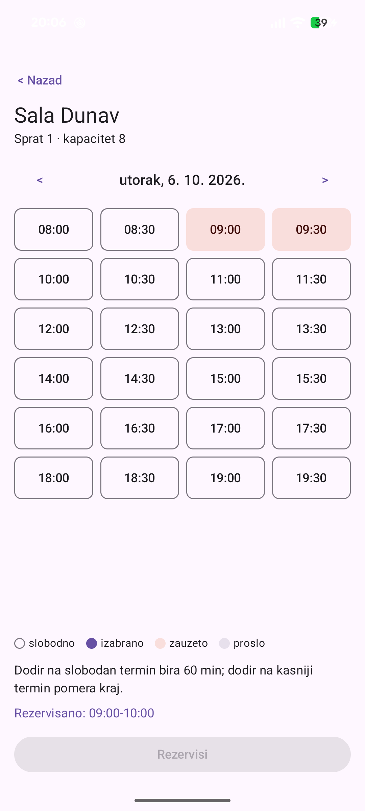
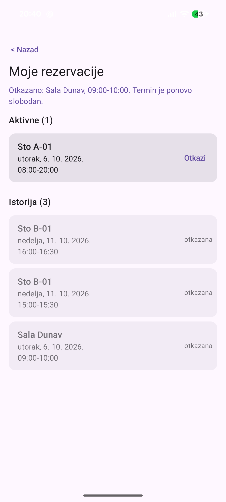
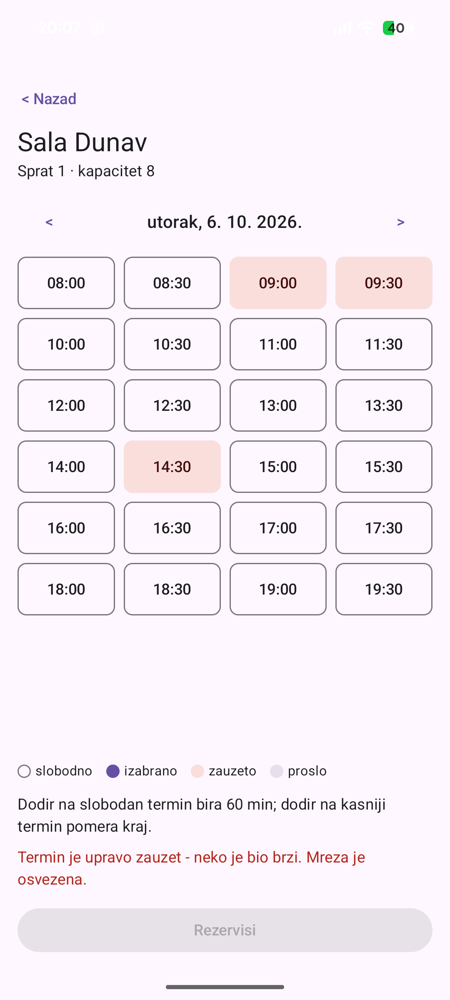
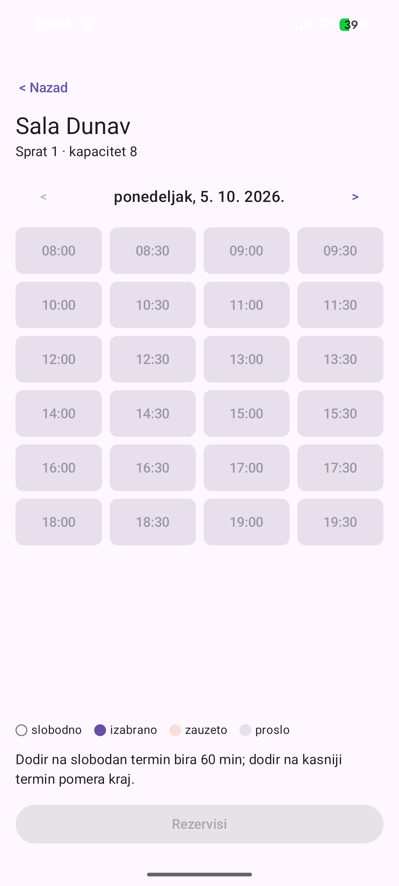

# Hot-Desking & Resource Booking System

Klijent-server sistem za rezervaciju deljenih resursa, radnih stolova i sala za sastanke,
u kompanijskom okruženju. Zaposleni pretražuju slobodne termine i rezervišu ih, a
administrator upravlja time koji su resursi uopšte na raspolaganju. Realizovan je u Kotlin
Multiplatform arhitekturi, sa deljenim modelom podataka i pravilima između Ktor servera
i Android klijenta.

---

## 1. Uloge i funkcionalnosti

Sistem razlikuje dve uloge sa različitim pogledom na iste podatke.

### Administrator

- **CRUD nad resursima:**  dodavanje stolova i sala, izmena opisnih parametara
  (kapacitet, lokacija, oprema)
- **Upravljanje raspoloživošću:** deaktivacija resursa koji je van funkcije ili se renovira
- **Globalni pregled:** uvid u sve rezervacije u sistemu, sa filtriranjem po korisniku
  ili po resursu

### Korisnik

- **Pretraga resursa:** filtriranje po tipu, lokaciji i opremi
- **Pregled dostupnosti:** dnevna mreža slobodnih i zauzetih termina za izabrani resurs
- **Rezervacija:** zauzimanje slobodnog termina
- **Moje rezervacije:** pregled aktivnih i isteklih, sa mogućnošću otkazivanja

### Dve odluke

**Deaktivacija resursa ne dira postojeće rezervacije.** Kaskadno otkazivanje bi korisniku
oduzelo termin bez ikakvog obaveštenja. Umesto toga
resurs izlazi iz ponude za nove rezervacije, a administrator u globalnom pregledu vidi koje
rezervacije još uvek vise nad njim i može da ih otkaže pojedinačno.

**Otkazivanje oslobađa termin, ali čuva zapis.** Rezervacija ostaje sa statusom `CANCELLED`.
Razlog je tehnički i objašnjen je u poglavlju 3.

---

## 2. Aplikacija u radu

| Lista resursa | Mreža slotova | Moje rezervacije |
|---|---|---|
|  |  |  |

Ekrani su snimljeni sa fizičkog uređaja (Pixel 8, Android 17) povezanog na server preko
lokalne mreže. Posle prijave, korisnik vidi listu resursa sa filterima; dodir na resurs
otvara dnevnu mrežu od 24 slota, gde dodir na slobodan termin bira podrazumevanu dužinu
(sto ceo dan, sala sat vremena) i šalje rezervaciju. Pregled „Moje rezervacije" deli
aktivne od istorije: otkazana rezervacija ne nestaje, nego prelazi u istoriju, a njen
termin se odmah oslobađa.

Odgovor servera na `GET /api/resources`, skraćen na tri resursa:

```json
[
  {
    "id": "e32cc098-37e6-4c92-98e5-4b8924bdfdb7",
    "name": "Sala Dunav",
    "type": "MEETING_ROOM",
    "location": "Sprat 1",
    "capacity": 8,
    "amenities": ["projektor", "tabla", "video konferencija"],
    "isActive": true
  },
  {
    "id": "1ab08deb-3935-4892-be16-ad3b9164b0c9",
    "name": "Sto A-01",
    "type": "DESK",
    "location": "Sprat 1 - Open space",
    "capacity": 1,
    "amenities": ["dok stanica", "monitor 27\""],
    "isActive": true
  },
  {
    "id": "dd60e947-5e8a-477d-b026-c67341bc92b8",
    "name": "Sto A-03",
    "type": "DESK",
    "location": "Sprat 1 - Open space",
    "capacity": 1,
    "amenities": [],
    "isActive": true
  }
]
```

Pun odgovor sadrži sedam resursa. `Seed.kt` upisuje osam, ali je `Sto B-02` neaktivan pa ga
podrazumevani filter `activeOnly=true` izostavlja — `GET /api/resources?activeOnly=false`
vraća i njega.

---

## 3. Ključni problem: sprečavanje preklapanja rezervacija

Rezervacija resursa nije CRUD zadatak. Čim dva korisnika istovremeno
zatraže isti termin, javlja se problem koji se ne rešava aplikativnom logikom.

### Problem

Naivna implementacija radi provera-pa-upis:

```kotlin
if (nemaPreklapanja(resourceId, start, end)) {   // ①
    upisiRezervaciju(...)                        // ②
}
```

Između ① i ② drugi zahtev može da upiše iste termine. Obe provere prolaze, obe rezervacije
se upisuju, dva čoveka dolaze u istu salu. Ovo je TOCTOU (*time-of-check to time-of-use*)
i ne rešava se dodavanjem provera.

### Razmatrani pristupi

| Pristup | Zašto nije izabran |
|---|---|
| `SELECT ... FOR UPDATE` nad resursom | Radi, ali serijalizuje sve rezervacije nad istim resursom i uvodi rizik od zastoja pri složenijim upitima |
| `SERIALIZABLE` izolacija + ponovni pokušaj | Radi, ali zahteva petlju ponovnog pokušaja u aplikaciji i teško se testira |
| PostgreSQL `EXCLUDE USING gist` nad `tstzrange` | Najelegantnije za slobodne vremenske opsege, ali H2 ga nema i projekat bi bio vezan isključivo za PostgreSQL |

### Izabrano rešenje

Vreme je diskretizovano na **slotove od 30 minuta** (radno vreme 08:00–20:00, 24 slota dnevno).
Rezervacija se čuva u dve tabele: zaglavlje u `bookings`, a jedan red po zauzetom slotu u
`booking_slots`, nad kojom stoji **jedinstveni indeks** `UNIQUE (resource_id, slot_start)`.

Rezervacija od 90 minuta upisuje tri reda. Preklapanje time postaje **fizički nemoguće**,
nezavisno od broja paralelnih zahteva; baza je jedini arbitar. Aplikacija ne proverava
zauzetost uopšte: piše odmah i hvata izuzetak narušavanja ograničenja, koji vraća kao
`409 Conflict`.

Prednosti:

- nema zaključavanja i nema petlje ponovnog pokušaja
- radi identično na H2 i na PostgreSQL-u
- delimično preklapanje (09:00–10:00 naspram 09:30–10:30) pada isto kao potpuno
- otkazivanje briše redove iz `booking_slots` i oslobađa termin, dok zaglavlje ostaje
  kao istorija — bez potrebe za parcijalnim indeksima, koje H2 ne podržava

### Merljiv rezultat

`server/src/test/kotlin/.../ConcurrencyTest.kt` ispaljuje 50 paralelnih zahteva za isti
termin i tvrdi da prolazi tačno jedan. Test se pokreće u dva prolaza:

1. bez jedinstvenog indeksa, sa provera-pa-upis logikom → pada, prolazi više rezervacija
2. sa jedinstvenim indeksom → prolazi

Izmereno, drugi prolaz, H2 baza u memoriji:

```
Paralelnih zahteva: 50 | prihvaceno: 1 | odbijeno (409): 49
```

Uz taj test prolaze i `delimicno_preklapanje_takodje_pada` (09:00–10:00 naspram 09:30–10:30,
dele tačno jedan slot) i `otkazana_rezervacija_oslobadja_termin`. Ukupno tri testa u `:server`
i trinaest testova `BookingRules` u `:core` — svi prolaze.

### Iz ugla korisnika



Aplikacija prikazuje mrežu slotova onakvu kakva je bila u trenutku učitavanja. Između
učitavanja i slanja drugi korisnik može da zauzme isti termin — upravo situacija iz
odeljka „Problem".

Provereno na uređaju: na telefonu je izabran termin 14:00–15:00, a sa drugog klijenta
je u međuvremenu zauzet 14:30–15:00. Zahtev sa telefona, poslat nad zastarelom mrežom,
dobija `409` sa kodom `SLOT_TAKEN`; aplikacija prikazuje poruku i osvežava mrežu.

Dva termina dele samo jedan slot, a odbijen je **ceo** zahtev: 14:00 je ostao slobodan,
i u bazi nije ostalo zaglavlje odbijene rezervacije. Izuzetak se propušta izvan
transakcije, pa se poništava i već upisano zaglavlje — što je u `BookingService.kt`
navedeno kao najlakše mesto za grešku u celom rešenju.

<br clear="right">

---

## 4. Merenja

Merenja su uvedena od faze 1, kao niz uporedivih tačaka posle svakog većeg koraka, a ne
kao jednokratna provera na kraju. Uslovi su isti u svakoj tački: ista mašina, k6 za
opterećenje i `jcmd` za memoriju, samostalni JAR umesto pokretanja kroz Gradle,
zagrevanje koje se odbacuje. Svaki izveštaj beleži okruženje, metodologiju i ograničenja.

| Tačka merenja | Commit | Izveštaj |
|---|---|---|
| Faza 1 | `8ed000a` | [`docs/merenja/faza-1`](docs/merenja/faza-1/README.md) |
| Posle autentikacije | `2026226` | [`docs/merenja/faza-2-korak-1`](docs/merenja/faza-2-korak-1/README.md) |
| Kraj faze 2 | `60daee4` | [`docs/merenja/faza-2-kraj`](docs/merenja/faza-2-kraj/README.md) |

| | Faza 1 | Posle autentikacije | Kraj faze 2 |
|---|---|---|---|
| Topao start (do prvog odgovora) | 1 764 ms | 1 761 ms | 1 770 ms |
| Hladan start (prazna baza) | 1 778 ms | 2 292 ms | 2 316 ms |
| Memorija stvarno zauzeta posle GC-a | 15,1 MB | 17,0 MB | 17,0 MB |
| `GET /api/resources` — zahteva/s, medijana | 3 250, 2,90 ms | 3 326, 2,85 ms | 3 305, 2,84 ms |
| `GET /availability` — zahteva/s, medijana | 3 161, 2,97 ms | 3 312, 2,82 ms | 3 317, 2,79 ms |
| `GET /api/bookings/mine` — medijana | — | 3,40 ms | 3,29 ms |
| `POST /api/auth/login` — medijana | — | 427 ms | 440 ms |
| Samostalni JAR | 20,5 MB | 27,3 MB | 27,3 MB |
| Neuspelih zahteva | 0 / 192 365 | 0 / 281 562 | 0 / 283 655 |

AMD Ryzen 7 5800H, 13,9 GB RAM, Windows 11, JDK 21, 10 istovremenih korisnika, preko `localhost`.

**Glavni nalazi:**

- **Odziv i stabilnost.** Server na razvojnom laptopu opslužuje oko 3 300 zahteva u sekundi
  uz medijanu ispod 3 ms. Nijedan od oko 758 000 zahteva kroz tri merenja nije pao.
- **Memorija.** Aplikacija posle sakupljanja smeća drži 15–17 MB. Radni skup od oko
  150–170 MB u mirovanju pretežno je trošak same JVM, ne podataka aplikacije.
- **Deljena logika nema merljiv trošak.** Ruta `availability` izvršava `BookingRules` iz
  deljenog modula i po medijani je u rangu rute koja samo čita listu.
- **Autentikacija: skupo jednom, jeftino uvek.** Provera tokena traje oko 2,5 µs; prijava
  oko 256 ms, namerno, zbog BCrypt-a. Odnos je oko 100 000 : 1.
- **Prava vremenska zona.** `kotlinx-datetime` je izolovano oko 100 puta sporiji od ranijeg
  fiksnog pomeraja, ali apsolutno košta oko 0,1 µs po pozivu — na sistemu nemerljivo.
- **Ekosistem.** Autentikacija je donela 6,8 MB tranzitivnih zavisnosti (Guava, Jackson,
  Ktor HTTP klijent), od kojih se nijedna u projektu ne koristi. Ktor-ova JWT podrška je
  tanak omotač oko Java biblioteke, koja sa sobom donosi deo Java ekosistema.

**Ograda.** Apsolutni brojevi sami po sebi još ne dokazuju da je performansa „u rangu
adekvatnom za serverski deo" — za to je potreban komparator, npr. ekvivalentan servis na
drugoj platformi izmeren na istoj mašini. To je sledeći korak u merenjima.

---

## 5. Arhitektura

Tri modula nose sistem:

```
          ┌─────────────────────────┐
          │         :core           │   Kotlin Multiplatform
          │  DTO klase + enumi      │   čist Kotlin kod; zavisi samo od
          │  BookingRules           │   kotlinx-serialization i -datetime
          └───────────┬─────────────┘
                      │
          ┌───────────┴────────────┐
          │                        │
  ┌───────▼────────┐     ┌─────────▼─────────┐
  │    :server     │     │ :app:androidApp   │
  │  Ktor Server   │     │  Jetpack Compose  │
  │  Exposed ORM   │◄────┤  Ktor Client      │
  │  H2 / Postgres │ HTTP│  ViewModel + UDF  │
  └────────────────┘ JSON└───────────────────┘
```

`settings.gradle.kts` navodi i četvrti modul, `:app:shared`. Njega generiše zvanični
Kotlin Multiplatform čarobnjak kao mesto za deljeni Compose UI. Ne koristi se ni posle
faze 2: postoji samo Android klijent, pa svi ekrani žive u `:app:androidApp`, i deljenje
korisničkog interfejsa između platformi još nema svrhu. Modul je kandidat za uklanjanje
ako se drugi klijent ne uvede.

### Šta deljeni modul zapravo nosi

Modul ne sadrži samo prazne `data` klase. Nosi dve stvari koje se inače dupliraju i
vremenom raziđu:

**Enumi** (`Role`, `ResourceType`, `BookingStatus`). Da su `String`-ovi, server bi mogao da
pošalje `"meeting_room"` a klijent da očekuje `"MEETING_ROOM"`, i to bi se otkrilo tek u
vreme izvršavanja. Ovako kompajler odbija da izgradi projekat.

**`BookingRules`** validacija termina. Ista funkcija se izvršava na dva mesta sa dve svrhe:
na klijentu da korisnik odmah vidi zašto dugme ne radi, na serveru kao autoritet, jer se
klijentu ne veruje. Bez deljenog modula ta logika postoji dvaput i razilazi se pri prvoj
izmeni.



Od faze 2 to je ponašanje aplikacije, ne samo namera. Mreža slotova na telefonu koristi
iste funkcije iz `:core` koje server poziva:

- `validate()` odlučuje koji slotovi mogu da se izaberu. Snimak desno je današnji dan
  posle 20:00: server za sva 24 slota kaže da su slobodna, jer zna samo za zauzetost; klijent
  ih prikazuje kao prošle, jer `validate()` odbija termin u prošlosti.
- `defaultSlots()` određuje koliko se bira jednim dodirom — sto ceo dan, sala sat vremena.
- `validate()` se ponovo poziva nad celim izborom neposredno pre slanja, a zatim još jednom
  na serveru.

Isto važi i za model: `LoginRequest`, `BookingDto` i enum `Role` su iste klase koje
server serijalizuje, a klijent deserijalizuje — na klijentu nije napisana nijedna
paralelna definicija.

<br clear="right">

Testovi u `commonTest` izvršavaju se na svakom targetu, jedna provera dokazana istovremeno za server i za Android.

---

## 6. Model podataka

Sto i sala koriste **isti** model. Razlikuje se samo ono što interfejs nudi (sto se uzima za ceo dan ili pola dana, sala u blokovima od pola sata). Krajnje vreme je ekskluzivno:
rezervacija 09:00–10:00 zauzima slotove 09:00 i 09:30.

```
users                     resources                  resource_amenities
──────────                ──────────                 ──────────────────
id (PK)                   id (PK)                    resource_id (FK)
name                      name                       amenity
email (UQ)                type                       PK(resource_id, amenity)
password_hash             location
role                      capacity
                          is_active

bookings                          booking_slots
────────                          ─────────────
id (PK)                           booking_id (FK)
resource_id (FK) ─────────────┐   resource_id
user_id (FK)                  └──▶ slot_start
start_time                        ★ UNIQUE (resource_id, slot_start)
end_time
status
created_at
```

`bookings` nosi identitet, vlasnika i istoriju. `booking_slots` nosi garanciju zauzetosti.

`password_hash` od faze 2 čuva BCrypt heš (cena 12), nikad samu lozinku. Heš ima 60
znakova i staje u postojeću kolonu `varchar(100)`, pa šema nije menjana.

---

## 7. Tehnološki stek

| Sloj | Tehnologija |
|---|---|
| Jezik | Kotlin, na svim slojevima |
| Deljeni modul | Kotlin Multiplatform |
| Backend | Ktor Server (Netty, korutine) |
| ORM | Exposed |
| Baza | H2 podrazumevano, PostgreSQL kroz konfiguraciju |
| Serijalizacija | kotlinx.serialization (JSON) |
| Android UI | Jetpack Compose, Material 3 |
| Upravljanje stanjem | ViewModel + StateFlow, unidirekcioni tok podataka |
| Mrežni klijent | Ktor Client (OkHttp engine) |
| Autentikacija | JWT (HS256) za zahteve, BCrypt za lozinke |
| Datum i vreme | kotlinx-datetime, vremenska zona `Europe/Belgrade` |

Baza se menja izmenom četiri linije u `server/src/main/resources/application.conf`; nijedna
linija aplikativnog koda ne zna koja je ispod. H2 je podrazumevan jer ne zahteva instalaciju.

Verzije su zaključane u `gradle/libs.versions.toml`:

| Komponenta | Verzija |
|---|---|
| Kotlin | 2.4.10 |
| Gradle | 9.1.0 |
| Android Gradle Plugin | 9.0.1 |
| Ktor (server i klijent) | 3.5.2 |
| Exposed | 1.0.0 |
| H2 | 2.3.232 |
| kotlinx.serialization | 1.11.0 |
| kotlinx-datetime | 0.8.0 |
| BCrypt (`at.favre.lib:bcrypt`) | 0.10.2 |
| java-jwt (tranzitivno, preko `ktor-server-auth-jwt`) | 4.6.0 |
| Compose Multiplatform | 1.11.1 |
| JDK | 21 (Temurin) |
| Android minSdk | 26 (Android 8.0) |

minSdk je u fazi 2 podignut sa 24 na 26 zbog `kotlinx-datetime`, koji se na Androidu
oslanja na `java.time`, dostupan od API nivoa 26.

Exposed 1.0 koristi pakete `org.jetbrains.exposed.v1.core` i `org.jetbrains.exposed.v1.jdbc`;
izraz-graditelji (`eq`, `less`, `greaterEq`, `inList`) su top-level funkcije koje se uvoze
sa `import org.jetbrains.exposed.v1.core.*`.

---

## 8. REST API

| Metod | Putanja | Uloga | Opis |
|---|---|---|---|
| `GET` | `/health` | javno | Provera dostupnosti servera |
| `POST` | `/api/auth/login` | javno | Prijava → JWT token i podaci o korisniku |
| `GET` | `/api/resources` | javno | Lista resursa; filteri `type`, `location`, `activeOnly` |
| `GET` | `/api/resources/{id}` | javno | Jedan resurs |
| `GET` | `/api/resources/{id}/availability?at=` | javno | Dnevna mreža slotova |
| `POST` | `/api/resources` | admin | Novi resurs |
| `PUT` | `/api/resources/{id}` | admin | Izmena resursa |
| `POST` | `/api/resources/{id}/deactivate` | admin | Deaktivacija |
| `POST` | `/api/resources/{id}/activate` | admin | Aktivacija |
| `POST` | `/api/bookings` | korisnik | Nova rezervacija → `201` ili `409` |
| `GET` | `/api/bookings/mine` | korisnik | Moje rezervacije |
| `GET` | `/api/bookings` | admin | Globalni pregled; filteri `userId`, `resourceId` |
| `DELETE` | `/api/bookings/{id}` | korisnik, admin | Otkazivanje — korisnik svoje, administrator bilo koje |

„Korisnik" znači bilo koji prijavljeni korisnik, uključujući administratora. Identitet i
uloga se čitaju isključivo iz tokena (`Authorization: Bearer ...`), nikad iz tela zahteva.
Zahtev bez ispravnog tokena Ktor odbija sa `401` pre nego što se ruta izvrši; zahtev sa
ispravnim tokenom, ali bez uloge `ADMIN`, na administratorskoj ruti dobija `403`.

---

## 9. Faze izrade

| Faza | Sadržaj | Status | Git oznaka |
|---|---|---|---|
| 1 | Vertikalni presek: deljeni DTO → Ktor ruta → baza → Compose lista | **urađeno** | `faza-1` |
| 2 | Autentikacija (JWT + BCrypt), mreža slotova i rezervacija u aplikaciji, moje rezervacije i otkazivanje, prava vremenska zona | **urađeno** | `faza-2` |
| 3 | Administratorski ekrani, filteri, globalni pregled | sledeće | |
| 4 | Testovi konkurentnosti, merenja, PostgreSQL varijanta | | |

Svaka završena faza ima git oznaku, pa se stanje projekta na kraju faze dobija sa
`git checkout faza-1` ili `git checkout faza-2`. Merenja nisu ostavljena za fazu 4: rade
se od faze 1, posle svakog većeg koraka (poglavlje 4). Faza 4 ih zaokružuje poređenjem sa
komparatorom i PostgreSQL varijantom.

---

## 10. Poznata ograničenja

Navedena svesno, kao predložene granice obima:

- **Sesija postoji samo u memoriji aplikacije.** Token se ne čuva na uređaju, pa se prijava
  traži pri svakom pokretanju. Trajno čuvanje bi otvorilo pitanje zaštite tokena u skladištu
  uređaja, a token ionako važi 24 sata.
- **Razvojna JWT tajna stoji u `application.conf`**, da bi se projekat pokrenuo bez ikakvog
  podešavanja. Repozitorijum je javan, pa ta vrednost nije tajna; u stvarnom okruženju se
  postavlja promenljiva `JWT_SECRET`, koja je pregazi.
- **Lozinke demo naloga su javne** u `Seed.kt`. U bazu se upisuje samo njihov BCrypt heš.
- **Autentikacija donosi zavisnosti koje se ne koriste.** `ktor-server-auth-jwt` tranzitivno
  uvlači Guava, Jackson i Ktor HTTP klijent (+6,8 MB JAR-a), iako server koristi samo HS256
  sa lokalnom tajnom. Nisu isključene iz build-a.
- **Vremenska zona je fiksirana na `Europe/Belgrade`**, i na serveru i na klijentu, namerno:
  radno vreme 08:00–20:00 je radno vreme kancelarije, ne telefona. Korisnik u drugoj zoni
  vidi termine po beogradskom vremenu.
- **Ktor Client** je u `:app:androidApp`, ne u `:core`. Deljeni modul zato pokriva model i
  pravila, ali ne i mrežni sloj. Razlog je što `ApiClient` koristi OkHttp engine, koji je
  platformski; selidba u `:core` traži `expect`/`actual` engine i ima smisla tek uz drugi
  klijent.
- **Android klijent nema automatske testove.** Proveren je ručno, na fizičkom uređaju;
  pravila koja koristi (`BookingRules`) pokrivena su testovima u `:core`.

---

## 11. Pokretanje

Potreban je JDK 21; Gradle se preuzima kroz wrapper. Sve komande se pokreću **iz korena
projekta** — foldera u kome se nalazi `gradlew.bat`.

```bash
# Server — H2 baza, bez ikakve instalacije
.\gradlew.bat :server:run
# http://localhost:8080/api/resources
```

```bash
# Testovi
.\gradlew.bat :core:jvmTest     # pravila validacije (BookingRules), 13 testova
.\gradlew.bat :server:test      # konkurentnost, 3 testa
```

Na Linux-u i macOS-u umesto `.\gradlew.bat` ide `./gradlew`.

Pri prvom pokretanju server upisuje početne podatke, uključujući dva demo naloga:

| Uloga | E-pošta | Lozinka |
|---|---|---|
| Administrator | `admin@firma.rs` | `admin123` |
| Korisnik | `pera@firma.rs` | `pera123` |

Ako je server pokretan još u fazi 1, stara baza `server/build/hotdesk.mv.db` sadrži
lozinke u čistom tekstu, a početni podaci se ne upisuju ponovo preko postojećih — prijava
tada vraća `401`. Rešenje je obrisati taj fajl pre pokretanja.

JWT tajna se van razvojnog okruženja zadaje promenljivom okruženja, npr. u PowerShell-u:

```bash
$env:JWT_SECRET = "dugacka-nasumicna-vrednost"
.\gradlew.bat :server:run
```

Android modul se pokreće iz Android Studio-a, ili sa priključenim uređajem komandom
`.\gradlew.bat :app:androidApp:installDebug`. Potreban je Android 8.0 ili noviji.

Adresa servera se podešava na **dva** mesta i oba moraju da se slažu:

| Uređaj | `ApiClient.baseUrl` | `network_security_config.xml` |
|---|---|---|
| Emulator | `http://10.0.2.2:8080` | već sadrži `10.0.2.2` |
| Fizički telefon | `http://<IP-laptopa>:8080` | dodati `<IP-laptopa>` |

`ApiClient.baseUrl` se postavlja u `MainActivity.kt`, pri pokretanju aplikacije.
IP razvojne mašine se dobija komandom `ipconfig` (IPv4 Address). Oba uređaja moraju biti
na istoj mreži. Fajl `app/androidApp/src/main/res/xml/network_security_config.xml` postoji
zato što Android od verzije 9 blokira nekriptovani HTTP — bez upisane adrese aplikacija
tiho ne uspeva da se poveže, a poruka o grešci ne kaže zašto.
